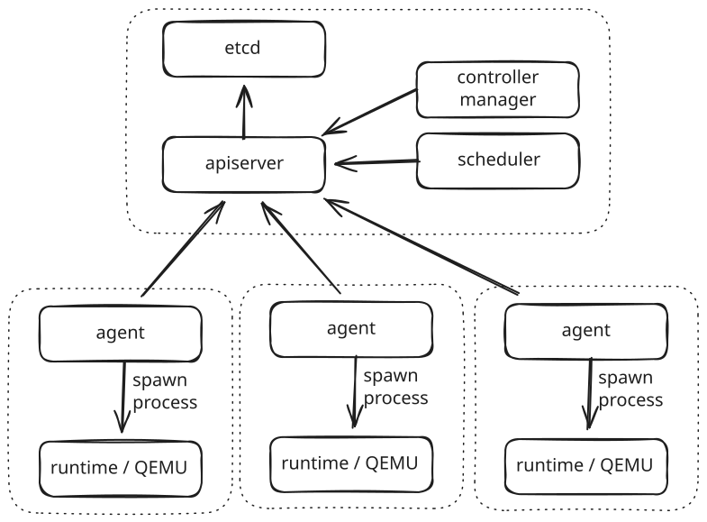

# Tugboat

[English](./README.md)

Tugboatは、KubernetesのようにVMのオーケストレーションを行うシステムです。

## Introduction

Tugboatは、Kubernetesのような機能を提供するVMのオーケストレーションツールです。
KubeVirtのような重量感を軽減し、OpenStackのような複雑さを排除します。

Tugboatはetcdとtugboat-apiserver、tugboat-agent、tugboat-runtime、tugboat-scheduler、tugboat-controller-managerという最小構成でVMをKubernetesのように管理することを目指しています。

## Why Tugboat?

既存のVMオーケーストレーションには以下のような課題があります。

- KubeVirt
    - Kubernetesの上にVMを乗せるため、二重構造で重い
    - libvirtやCRDが複雑
- OpenStack
    - コンポーネントが多すぎて個人や小規模には扱えない
    - 学習コストが非常に高い
    - 運用が難しい

Tugboatはこれらの問題を解決するために生まれました。

- Kubernetesの思想を継承
- Kubernetesそのものは使わない
- VMに最適化した軽量な設計
- 個人でも動かせる単純さ
- 大規模化にも耐えられる構造

## Key Features

- Kubernetes互換のAPIマニフェスト
    - TypeMeta / ObjectMetaなどKubernetesと同じ構造
    - `kubectl`がそのまま利用可能
- etcdベースの宣言的クラスタ
    - apiserverはstatelessでetcdが唯一の状態
- 軽量なコントロールプレーン
    - apiserverとschedulerのみ
- QEMUを直接使用
    - libvirtを使わずQEMUを直接exec
- agent / runtimeの責務分離
    - Kubernetesのkubelet / runtimeと同じ思想
- OCIアーティファクトとしてのVMイメージ
    - Imagefile → build → registryにpush → Shipから参照
- CNIに対応
    - `NetworkClass` / `ClusterNetworkClass`によるネットワーク設定
    - agent が `Node.status.cniPlugins` に plugin readiness を公開
    - scheduler が `NetworkFit` で node を絞り込み
- RBAC / ServiceAccount
    - `Role` / `ClusterRole`、`RoleBinding` / `ClusterRoleBinding`、`ServiceAccount` API (`authorization/v1`)
    - apiserver で適用される動詞・リソース単位の細粒度アクセス制御
    - 組み込みロール: `cluster-admin`、`admin`、`edit`、`view`
    - ServiceAccount ごとに不透明なベアラートークンを発行し Secret に保存
- CRDに対応予定
- HA設計
    - apiserverは水平スケール可能
    - schedulerはLeaseによる調停

## Architecture overview



### Kubernetesリソースとの対応

|   Kubernetes    |    Tugboat     |
|:---------------:|:--------------:|
|       Pod       |      Ship      |
|   ReplicaSet    |   ReplicaSet   |
|   Deployment    |   Deployment   |
|      Node       |      Node      |
| Container image | VM image (OCI) |
|   Dockerfile    |   Imagefile    |
|     kubelet     |     agent      |
|  RuntimeClass   |  RuntimeClass  |

> **補足:** `Fleet` は複数の Ship タイプがプライベートネットワークを共有するグループを表す Tugboat 独自のリソースで、Kubernetes
> に直接対応するものはありません。

## Manifest examples

### ShipClass

VMのマシンタイプを定義するリソースです。
クラスタリソースです。

```yaml
apiVersion: v1
kind: ShipClass
metadata:
  name: lightweight
spec:
  cpu:
    architecture: x64
    cores: 2
  memory:
    size: 4Gi
```

### Ship

VMインスタンスを定義するリソースです。
Namespacedリソースです。

```yaml
apiVersion: v1
kind: Ship
metadata:
  namespace: default
  name: ship
spec:
  image: ghcr.io/sileader/tugboat-vm-images/ubuntu:24.04
  shipClass: lightweight
  volumes:
    - name: data-disk
      persistentVolumeClaim:
        claimName: data-disk
    - name: app-config
      configMap:
        name: app-config
    - name: app-secret
      secret:
        secretName: app-secret
```

### Fleet

複数の Ship タイプがプライベートネットワークを共有するグループを定義するリソースです。
Namespaced リソースです（`apps/v1`）。

```yaml
apiVersion: apps/v1
kind: Fleet
metadata:
  namespace: default
  name: my-fleet
spec:
  networkClassName: my-network-class
  components:
    - name: frontend
      replicas: 2
      shipTemplate:
        metadata:
          labels:
            role: frontend
        spec:
          image: ghcr.io/sileader/tugboat-vm-images/ubuntu:24.04
          shipClass: lightweight
    - name: backend
      replicas: 3
      shipTemplate:
        metadata:
          labels:
            role: backend
        spec:
          image: ghcr.io/sileader/tugboat-vm-images/ubuntu:24.04
          shipClass: lightweight
```

### Deployment

同一構成の Ship の集合をローリングアップデート付きで管理します。
Namespaced リソースです（`apps/v1`）。

```yaml
apiVersion: apps/v1
kind: Deployment
metadata:
  namespace: default
  name: my-deployment
spec:
  replicas: 3
  selector:
    app: my-app
  shipTemplate:
    metadata:
      labels:
        app: my-app
    spec:
      image: ghcr.io/sileader/tugboat-vm-images/ubuntu:24.04
      shipClass: lightweight
```

### ReplicaSet

レプリカ Ship の安定したセットを維持します。
Namespaced リソースです（`apps/v1`）。

```yaml
apiVersion: apps/v1
kind: ReplicaSet
metadata:
  namespace: default
  name: my-replicaset
spec:
  replicas: 2
  selector:
    app: my-app
  shipTemplate:
    metadata:
      labels:
        app: my-app
    spec:
      image: ghcr.io/sileader/tugboat-vm-images/ubuntu:24.04
      shipClass: lightweight
```

### RuntimeClass

ノード上のVMランタイムが持つケーパビリティ（ライブマイグレーション対応、ホットプラグ対応）を宣言するリソースです。
クラスタリソースです。

```yaml
apiVersion: v1
kind: RuntimeClass
metadata:
  name: standard
spec:
  liveMigration: true
  hotplug:
    cpu:
      add: true
      remove: false
    memory:
      add: true
      remove: false
    nic:
      add: true
      remove: true
    storage:
      add: true
      remove: true
```

Ship は `spec.runtimeClass` フィールドで RuntimeClass 名を参照できます。
スケジューラの `RuntimeClassFit` プラグインが、Ship の要件（ライブマイグレーション対応など）を満たす RuntimeClass
を持つノードにのみスケジューリングします。

### CSI サポート

CSI volume は `spec.volumes[].persistentVolumeClaim` で同一 namespace の
`PersistentVolumeClaim` を参照できます。後方互換のため、従来の
`volumeClaimRef` も引き続き受け付けます。

現時点の node-side CSI サポート範囲:

- [x] `Block` volumeMode
- [x] `Filesystem` volumeMode
- [x] `NodeStageVolume` / `NodeUnstageVolume` を要求する driver
- [x] `nodePublishSecretRef` / `nodeStageSecretRef`
- [x] agent restart 後の publish state からの復旧
- [x] 明示的な `fs_type` と `volume_attributes`
- [x] `NodeExpandVolume` / volume expansion
- [x] controller publish context を必須とする driver
- [x] `NodeGetVolumeStats` による CSI volume の health / usage を PV/PVC condition へ反映

`Filesystem` volume は guest へ 9p share として公開され、mount tag には
Ship volume の名前が使われます。そのため、CSI の `Filesystem` claim だけでなく
`ConfigMap` / `Secret` の projected volume も同じ経路で guest へ渡されます。

control plane 側では、`PersistentVolume`、`PersistentVolumeClaim`、`StorageClass` の API に加えて、
`tugboat-controller-manager` による CSI の動的プロビジョニング、管理対象 PV の cleanup、容量指定付きの provision/expand、
`Filesystem` claim、CSI secret / `fsType` の引き回しまで実装済みです。node 側も controller publish context、稼働中の Ship
を停止させない live `NodeExpandVolume`、`NodeGetVolumeStats` による CSI health / usage の PV/PVC condition
反映まで対応しました。残る大きな課題は、scheduler の storage 制約考慮、永続 state 以上の recovery、snapshot / clone
系ワークフローです。

### CNI status と Flannel 検証

現在の Tugboat は、agent が観測した CNI readiness を `Node.status.cniPlugins`
に公開し、`tugboat-controller-manager` が
`NetworkClass.status.readyNodes` /
`ClusterNetworkClass.status.readyNodes` を更新します。scheduler の
`NetworkFit` filter は、この status を見て、Ship が要求する
`NetworkClass` / `ClusterNetworkClass` に必要な plugin を持たない node を除外します。

現状の前提は、Flannel 自体は Tugboat の外でインストール・管理されることです。
手動で multi-node Flannel を確認する場合は、次の流れを想定しています。

1. 各 node の CNI bin directory に `bridge`、`loopback`、`flannel`、
   および port mapping を使う場合は `portmap` を配置する。
2. 外部管理の Flannel を起動し、各 node に既定の runtime state
   （既定では `/run/flannel/subnet.env` と `/run/flannel`）を用意する。
3. 各 node で `tugboat-agent` を起動し、`kubectl get node -o yaml` で
   `status.cniPlugins` に readiness が反映されていることを確認する。
4. `cniPlugin: flannel` を使う `ClusterNetworkClass` または `NetworkClass`
   を apply し、`status.readyNodes` に probe を通過した node が現れることを確認する。
5. その network class を参照する Ship を作成し、準備済み node にだけ
   schedule されることを確認してから、node 間疎通を検証する。

## RBAC

TugboatはRBACシステムを提供します。
すべてのリクエストに対して、apiserverでアクセス制御が適用されます。

詳細ドキュメント:
- [RBACの概要](./docs/rbac.md)
- [Service Accountトークンとプロジェクション](./docs/service-account-tokens.md)
- [OIDC統合](./docs/oidc.md)
- [集約ClusterRole](./docs/aggregated-clusterroles.md)
- [監査ログ](./docs/audit-logging.md)

### リソース


| リソース                 | APIグループ            | スコープ       | 説明                                            |
|----------------------|--------------------|------------|-----------------------------------------------|
| `ServiceAccount`     | `core/v1`          | Namespaced | 自動化プロセスやコントローラのID                             |
| `Role`               | `authorization/v1` | Namespaced | 単一namespace内に限定された権限ルール                       |
| `ClusterRole`        | `authorization/v1` | Cluster    | クラスタ全体に適用される権限ルール                             |
| `RoleBinding`        | `authorization/v1` | Namespaced | `Role`または`ClusterRole`をnamespace内のサブジェクトに紐付ける |
| `ClusterRoleBinding` | `authorization/v1` | Cluster    | `ClusterRole`をクラスタ全体のサブジェクトに紐付ける              |

### 動詞とサブジェクト種別

サポートする動詞: `get`、`list`、`watch`、`create`、`update`、`patch`、`delete`、`deletecollection`

サブジェクト種別: `User`、`Group`、`ServiceAccount`

`resourceNames` を使って特定のリソースインスタンスに権限をさらに絞り込むことができます。

### 組み込みClusterRole

| ClusterRole     | 説明                                                      |
|-----------------|---------------------------------------------------------|
| `cluster-admin` | 全リソースへのフルアクセス                                           |
| `admin`         | namespace内のフルアクセス（RBAC・namespace自体の変更は不可）               |
| `edit`          | ほとんどのNamespacedリソースへの読み書きアクセス（Secretの読み取りおよびRBACの変更は不可） |
| `view`          | ほとんどのNamespacedリソースへの読み取り専用アクセス                         |

### マニフェスト例

#### ServiceAccount

```yaml
apiVersion: v1
kind: ServiceAccount
metadata:
  namespace: default
  name: my-service-account
```

#### Role

`default` namespace 内のShipへの読み取りアクセスを付与します。

```yaml
apiVersion: authorization/v1
kind: Role
metadata:
  namespace: default
  name: ship-reader
rules:
  - apiGroups: [ "" ]
    resources: [ "ships" ]
    verbs: [ "get", "list", "watch" ]
```

#### ClusterRole

クラスタ全体のNodeへの読み取りアクセスを付与します。

```yaml
apiVersion: authorization/v1
kind: ClusterRole
metadata:
  name: node-reader
rules:
  - apiGroups: [ "" ]
    resources: [ "nodes" ]
    verbs: [ "get", "list", "watch" ]
```

#### RoleBinding

`default` namespace内でユーザーとServiceAccountに `ship-reader` を紐付けます。

```yaml
apiVersion: authorization/v1
kind: RoleBinding
metadata:
  namespace: default
  name: ship-reader-binding
roleRef:
  apiGroup: authorization
  kind: Role
  name: ship-reader
subjects:
  - kind: User
    name: alice
  - kind: ServiceAccount
    namespace: default
    name: my-service-account
```

#### ClusterRoleBinding

クラスタ全体のグループに `node-reader` ClusterRole を付与します。

```yaml
apiVersion: authorization/v1
kind: ClusterRoleBinding
metadata:
  name: node-reader-binding
roleRef:
  apiGroup: authorization
  kind: ClusterRole
  name: node-reader
subjects:
  - kind: Group
    name: ops-team
```

#### 集約ClusterRole

`view` ロールにカスタムリソースの権限を追加します。

```yaml
apiVersion: authorization/v1
kind: ClusterRole
metadata:
  name: my-extension-view
  labels:
    rbac.tugboat.cloud/aggregate-to-view: "true"
rules:
  - apiGroups: ["my.example.com"]
    resources: ["myresources"]
    verbs: ["get", "list", "watch"]
```

#### OIDC RoleBinding

```yaml
apiVersion: authorization/v1
kind: RoleBinding
metadata:
  name: oidc-developers-binding
  namespace: default
subjects:
  - kind: Group
    name: oidc:developers
    apiGroup: authorization/v1
    roleRef:
      kind: ClusterRole
      name: view
      apiGroup: authorization/v1
```

#### Shipへのトークン自動投影

```yaml
apiVersion: core/v1
kind: Ship
metadata:
  name: my-ship
spec:
  serviceAccountName: my-sa
  automountServiceAccountToken: true
```

### 今後の拡張予定

- **Topology-aware scheduling と snapshot 系ワークフロー** — データの局所性に基づいた Ship の配置最適化と、ステートフルなワークロードの増分バックアップ・復元をサポート
- **CRD (Custom Resource Definition)** — Tugboat のコアを変更することなく、ユーザーが独自のリソース型を定義可能にする
- **高可用性（HA）設計** — apiserver の水平スケーリングとスケジューラの Lease ベースのリーダー選挙

## Roadmap

- [x] Runtime
    - [x] tugboat-qemu-runtime
    - [x] tugboat-cloud-hypervisor-runtime
- [x] tugboat-resources (リソース定義)
- [x] tugboat-resource-store (apiserver向けのetcdラッパー)
- [x] tugboat-apiserver
- [x] tugboat-client
- [x] tugboat-cli build (ImagefileからVMイメージのビルド)
- [x] fieldSelectorとlabelSelector
- [x] tugboat-scheduler
- [x] tugboat-agent
    - [x] Nodeリソースの自動登録
    - [x] Ship Addedイベントのreconcile
    - [x] ネットワーク (CNI, NetworkClass / ClusterNetworkClass)
    - [x] Ship Modifiedイベントのreconcile
    - [x] Ship Deletedイベントのreconcile
    - [x] ストレージ (CSI publish/stage, controller publish context, および live expansion)
    - [ ] Topology-aware scheduling と snapshot 系ワークフロー
- [x] Secret
- [x] Namespace リソース定義とAPI (`core/v1`)
- [x] tugboat-controller-manager
    - [x] CSIの動的プロビジョニング
    - [x] CSI管理下PVのcleanup
    - [x] ReplicaSet コントローラ (Shipの規定数維持)
    - [x] Deployment コントローラ (ReplicaSetのローリングアップデート管理)
    - [x] Fleet コントローラ
    - [x] NamespaceDefaultServiceAccountController (Namespaceごとに `default` ServiceAccount を自動作成)
    - [x] ServiceAccount トークン発行コントローラ (`service-account-token` Secret の作成)
- [x] Fleet リソース定義とAPI (`apps/v1`)
- [x] ReplicaSet リソース定義とAPI (`apps/v1`)
- [x] Deployment リソース定義とAPI (`apps/v1`)
- [x] ConfigMap
- [x] NetworkClass / ClusterNetworkClass リソース定義とAPI (`core/v1`)
- [x] PersistentVolume / PersistentVolumeClaim / StorageClass リソース定義とAPI (`core/v1`)
- [x] Lease リソース定義とAPI (`coordination/v1`)
- [x] ライブマイグレーション
    - [x] `target_node_name` によるマイグレーションのトリガー
    - [x] マイグレーションのステートマシン (Pending, Ready, Migrating, Completed, Failed)
    - [x] Ship のステータス・条件へのマイグレーション状態の反映
    - [x] 事前互換性チェック (CPU、共有ストレージ適格性、ターゲットネットワーク対応)
    - [x] マイグレーション失敗時の確実な復旧と明示的なエラー報告
    - [x] ノード間でブリッジ/インターフェース/MACを固定することによるゲスト/ネットワーク継続性
    - [x] タイムアウト検出と自動QEMUキャンセル (Pending: 2分、Migrating: 30分)
    - [x] ShipClassごとのQEMUマイグレーションパラメータ設定 (帯域幅、ダウンタイム、xbzrleキャッシュ、ポストコピー)
    - [x] スケジューラの StorageFit プラグインによる非 RWX ボリュームを持つ Ship のノード除外
- [x] RuntimeClass
    - [x] リソース定義とAPI (`core/v1`)
    - [x] Ship の `spec.runtimeClass` フィールド
    - [x] スケジューラの `RuntimeClassFit` プラグイン（ライブマイグレーション対応チェック）
    - [x] RuntimeClass フラグによるホットプラグ操作の制御
- [x] RBAC / ServiceAccount
    - [x] `ServiceAccount` リソース定義とAPI (`core/v1`)
    - [x] `Role` / `ClusterRole` リソース定義とAPI (`authorization/v1`)
    - [x] `RoleBinding` / `ClusterRoleBinding` リソース定義とAPI (`authorization/v1`)
    - [x] apiserverにおけるRBAC認可の適用
    - [x] 組み込みロール (`cluster-admin`、`admin`、`edit`、`view`)
    - [x] ServiceAccountトークンの生成と検証
        - [x] `service-account-token` 型 Secret による不透明なベアラートークンの発行
        - [x] namespace ごとの default ServiceAccount 自動作成
        - [x] audience・有効期限付きの署名済みJWT
    - [x] ShipへのServiceAccountトークン自動投影
    - [x] 外部IDプロバイダとのOIDC統合
    - [x] 集約ClusterRole
    - [x] 監査ログ
- [x] インストーラー (systemd)
    - [x] `install-control-plane.sh` — etcd・apiserver・scheduler・controller-manager を systemd ユニットとしてインストール
    - [x] `install-worker.sh` — agent と VM ランタイム（QEMU または Cloud Hypervisor）を systemd ユニットとしてインストール
    - [x] TLS / PKI 自動生成 (`setup-pki.sh`、`setup-etcd-pki.sh`)
    - [x] コントロールプレーン用 ServiceAccount トークンの RBAC ブートストラップ (`bootstrap-rbac.sh`)
    - [x] Flannel CNI サポート（static subnet.env / vxlan / host-gw）(`bootstrap-flannel.sh`)
    - [x] CSI hostpath プロビジョナーインストーラー (`install-csi-hostpath.sh`)
    - [x] `uninstall.sh` — Tugboat の全ユニット・バイナリ・設定ファイルを停止・削除
    - [x] シナリオスクリプト付き Docker 分離テスト環境 (`installer/systemd/test/`)
- [ ] CRD

## インストール

`installer/systemd/` ディレクトリには、Debian/Ubuntu ホストへ systemd を使って
Tugboat をインストール・設定するシェルスクリプトが含まれています。
root 権限と `apt-get` が必要です。

### コントロールプレーン

```bash
sudo installer/systemd/install-control-plane.sh \
    --build \
    --apiserver-host control-plane.example.com \
    --apiserver-ip 192.168.0.1
```

**etcd**、**tugboat-apiserver**、**tugboat-scheduler**、**tugboat-controller-manager** を
systemd サービスとしてインストールします。デフォルトでは API サーバーは TLS を有効にして
`0.0.0.0:8443` で待ち受けます（CA とサーバー証明書は自動生成）。
平文 HTTP（ポート 8080）を使う場合は `--insecure` を指定してください。

コンパイル済みバイナリを使う場合は `--build` の代わりに
`--use-prebuilt --bin-dir <path>` を指定します。

### ワーカー

```bash
sudo installer/systemd/install-worker.sh \
    --use-prebuilt --bin-dir /path/to/bins \
    --apiserver-url https://192.168.0.1:8443 \
    --ca-cert /etc/tugboat/pki/ca.crt \
    --service-account-token /path/to/agent-token
```

**tugboat-agent** と選択した VM ランタイム（`--runtime qemu` または
`--runtime cloud-hypervisor`）をインストールします。CNI プラグインは自動でインストールされます。
Flannel モードは `--flannel-mode static|vxlan|host-gw` で切り替えます
（デフォルト: `static`、この場合は flanneld を起動せずに `/run/flannel/subnet.env` を書き込みます）。

### アンインストール

```bash
sudo installer/systemd/uninstall.sh --control-plane   # コントロールプレーンノード
sudo installer/systemd/uninstall.sh --worker          # ワーカーノード
sudo installer/systemd/uninstall.sh --control-plane --worker --purge  # 全削除
```

### インストーラーのテスト

`installer/systemd/test/` に、systemd を PID 1 として動かす Ubuntu 24.04 コンテナを使った
Docker 分離テスト環境があります。全シナリオの実行は以下のコマンドで行います。

```bash
installer/systemd/test/run-tests.sh
```

## Contributing

まだ初期段階のプロジェクトですが、ご協力いただける方は歓迎します。

## License

Apache License 2.0

[LICENSE](./LICENSE)を参照してください。
